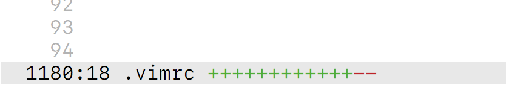

# How Dirty?
**work in progress, not ready**

How Dirty? uses the new async features in Vim 8 to display the red and green
plusses and minuses from `git diff --stat` in the status bar, so you always
know just how dirty the current file is.



Super cached, super snappy, super sexy

#### install

## install

# install


```vim
Plug 'supercrabtree/vim-how-dirty'
```
